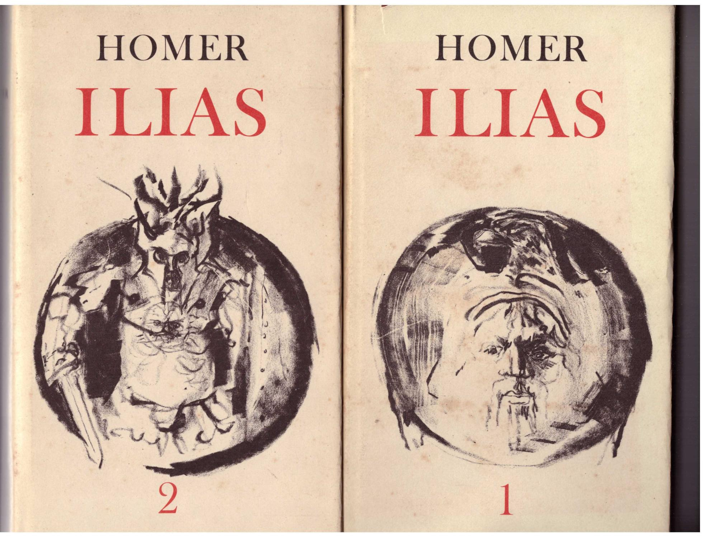
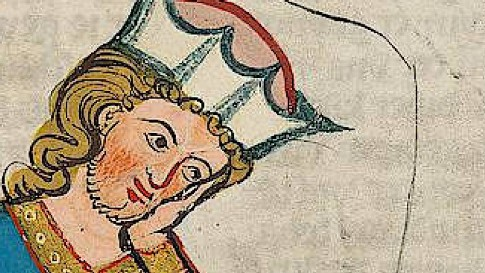
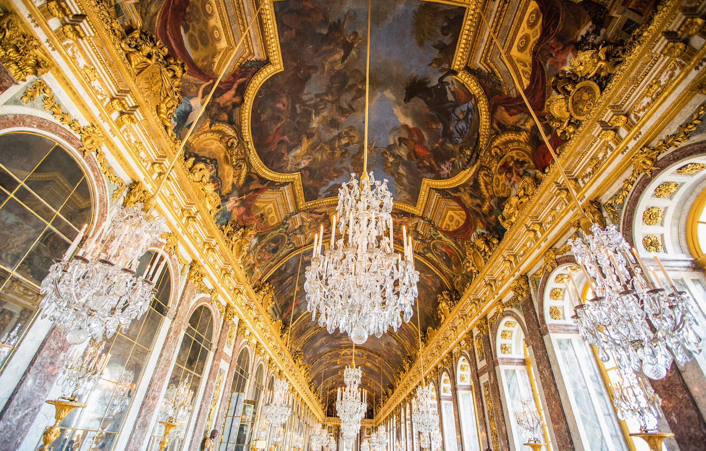
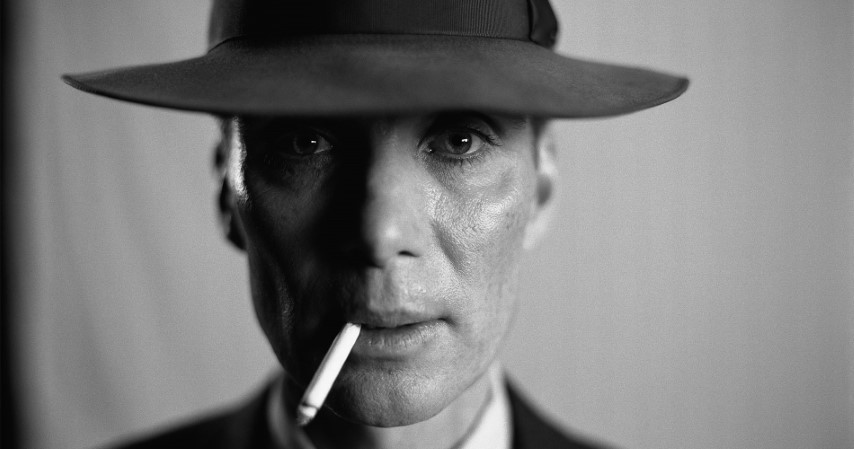

# 1. Tips & Inhalt
## 1.1. Tips

> - Naturalismus kommt nix,
> - Nigerlungenlied wichtig,
> - Bürgerliche Literatur !,
> - Barockzeit: Allgemein & Buchtitel,
> - Aufklärung,
> - ILSE EICHINGER !,
> - Realismus alle Authoren

---
## 1.2. Inhalt

- [1. Tips \& Inhalt](#1-tips--inhalt)
  - [1.1. Tips](#11-tips)
  - [1.2. Inhalt](#12-inhalt)
- [2. Griechische Epen](#2-griechische-epen)
- [3. Die ritterliche Dichtung](#3-die-ritterliche-dichtung)
  - [3.1. Heldenepos](#31-heldenepos)
  - [3.2. höfische Epos](#32-höfische-epos)
  - [3.3. Minnesang](#33-minnesang)
- [4. Die bürgerliche Literatur](#4-die-bürgerliche-literatur)
  - [4.1. Volksbücher](#41-volksbücher)
  - [4.2. Volkslieder](#42-volkslieder)
  - [4.3. Volksschauspiel](#43-volksschauspiel)
  - [4.4. Fastnachtspiel](#44-fastnachtspiel)
    - [4.4.1. Hans Sachs](#441-hans-sachs)
- [5. Renaissance, Humanismus (, Reformation)](#5-renaissance-humanismus--reformation)
  - [5.1. Renaissance](#51-renaissance)
  - [5.2. Humanismus](#52-humanismus)
- [6. Die Barockliteratur](#6-die-barockliteratur)
- [7. Aufklärung, Sturm und Drang](#7-aufklärung-sturm-und-drang)
  - [7.1. Aufklärung](#71-aufklärung)
    - [7.1.1. Immanuel Kant](#711-immanuel-kant)
    - [7.1.2. Gotthold Ephraim Lessing](#712-gotthold-ephraim-lessing)
  - [7.2. Sturm und Drang](#72-sturm-und-drang)
    - [7.2.1. Johann Wolfgang Goethe](#721-johann-wolfgang-goethe)
    - [7.2.2. Friedrich Schiller](#722-friedrich-schiller)
- [8. Deutsche Klassik](#8-deutsche-klassik)
  - [8.1. Goethe](#81-goethe)
  - [8.2. Schiller](#82-schiller)
- [9. Die Romantik](#9-die-romantik)
  - [9.1. Josef von Eichendorff](#91-josef-von-eichendorff)
  - [9.2. Ernst Theodor Amadeus Hoffmann](#92-ernst-theodor-amadeus-hoffmann)
  - [9.3. Brüder Jacob und Wilhelm Grimm](#93-brüder-jacob-und-wilhelm-grimm)
- [10. Das österreichische Biedermeier](#10-das-österreichische-biedermeier)
  - [10.1. Franz Grillparzer](#101-franz-grillparzer)
  - [10.2. Ferdinand Raimund](#102-ferdinand-raimund)
  - [10.3. Johann Nestroy](#103-johann-nestroy)
  - [10.4. Albert Stifter](#104-albert-stifter)
- [11. Realismus](#11-realismus)
  - [11.1. Gottfried Keller](#111-gottfried-keller)
  - [11.2. Theodor Storm](#112-theodor-storm)
  - [11.3. Peter Roseggers](#113-peter-roseggers)
  - [11.4. Ludwig Anzengruber](#114-ludwig-anzengruber)
- [12. Der Naturalismus](#12-der-naturalismus)
- [13. Die deutschsprachige Literatur im 20. Jahrhundert](#13-die-deutschsprachige-literatur-im-20-jahrhundert)
  - [13.1. Hugo von Hofmannsthal](#131-hugo-von-hofmannsthal)
  - [13.2. Arthur Schnitzler](#132-arthur-schnitzler)
  - [13.3. Joseph Roth](#133-joseph-roth)
  - [13.4. Ödön von Horváth](#134-ödön-von-horváth)
  - [13.5. Bertolt Brecht](#135-bertolt-brecht)
- [14. Literatur während der NS-Zeit](#14-literatur-während-der-ns-zeit)
- [15. Literatur der Nachkriegszeit](#15-literatur-der-nachkriegszeit)
  - [15.1. Die Bundesrepublik Deutschland (BRD)](#151-die-bundesrepublik-deutschland-brd)
    - [15.1.1. Wolfgang Borchert](#1511-wolfgang-borchert)
    - [15.1.2. Henrich Böll](#1512-henrich-böll)
    - [15.1.3. Günter Grass](#1513-günter-grass)
    - [15.1.4. Siegfried Lenz](#1514-siegfried-lenz)
    - [15.1.5. Dokumentartheater](#1515-dokumentartheater)
      - [15.1.5.1. Heinar Kipphardt](#15151-heinar-kipphardt)
      - [15.1.5.2. Gruppe 47](#15152-gruppe-47)
    - [15.1.6. Franz Xaver Kroetz](#1516-franz-xaver-kroetz)
  - [15.2. Die Deutsche Demokratische Republik (DDR)](#152-die-deutsche-demokratische-republik-ddr)
  - [15.3. Die Schweiz](#153-die-schweiz)
    - [15.3.1. Friedrich Dürrenmatt](#1531-friedrich-dürrenmatt)
  - [15.4. Österreich](#154-österreich)
    - [15.4.1. Thomas Bernhard](#1541-thomas-bernhard)
    - [15.4.2. Elfriede Jelinek](#1542-elfriede-jelinek)
---

# 2. Griechische Epen
> ~800 Jahre vor Christus

Personen:
- Homer

Werke: 
- Ilias
- Odyssee

Beide Werke waren **Epen** ("Griechische Epen") und wurden ursprünglich **mündlich** überliefert.

# 3. Die ritterliche Dichtung
> Miteralterliche Dichtung hatte seinen **Höhepunkt um 1200** und handelte & entstand vom **Rittertum**

Dichtungsarten: 
- Heldenlied
- Heldenepos
- höfische Epos
- Minnesang

## 3.1. Heldenepos
    
> Nibelungenlied

wurde von **unbekanntem österreichischem** Dichter vefasst

~ 2400 Strophen

*Do steht a wos mid "**Mittelhochdeutsch**", "neuhochdeutsch" und "Hochdeutsch"*

## 3.2. höfische Epos

> Parzival

von **Wolfram von Eschenbach**

idealer Ritter:
- "mâze" = Ausgewogenehit
- "staete" = Beständigkeit
- "muot" = edles Denken

## 3.3. Minnesang
> minne = Verehrung einer hochgestellten Dame

Nicht nur text, sondern auch **Ton (Melodie)**

wichtige Person: **Walter von der Vogelweide**
- stammte aus dem **Donauraum**
- lernte in **Wien** singen & sagen
- zog nach Wien **von Burg zu Burg**

---

# 4. Die bürgerliche Literatur

> Verlief im **13. & 14. Jahrhundert**

Nach Buchdruck-Erfindung (1450) wurden **Bücher** billiger 🤑 & **Bildungsbedürfnis** stieg ↑

## 4.1. Volksbücher
Werke:
- Till Eulenspiegel
- Doktor Faustus
- Die Schildbürger

## 4.2. Volkslieder
Wichtige Themen:
- Heimat
- Heimweh
- Abschied
- Wiederkehr
- Treue
- verratene Liebe
- Tod

## 4.3. Volksschauspiel
Wichtige Themen:
- Himmel
- Hölle

Heute noch als **Geistliche Spiele (Krippen- und Passionsspiele)**

## 4.4. Fastnachtspiel
### 4.4.1. Hans Sachs
Wichtige Werke:
- Der fahrende Schüler aus dem Paradies
- Das Narrenschneiden

# 5. Renaissance, Humanismus (, Reformation)
> Von 1450 bis 1600

## 5.1. Renaissance
> Renaissance steht für die **Wiedergeburt** *von der Antike*

Hauptsächlich Stil von Baukunst, Bildhauerei und Malerei der **Italiener**🍕🍝, aber auch **bedeutende Werke nördlich der Alpen**

## 5.2. Humanismus
> Steht für die **Bestrebungen der Wissenschaftler**

**Anknüpfung an die Antike**, das "**Humane**" (=Veredelung durch Bildung) zu erreichen

# 6. Die Barockliteratur
> - Prunkvolle Kirchen, Paläste und Schlösser
> 
> - Lange Kriege und böse Seuchen (Pest)

Oft findet man die **Mahnung, an den Tod** zu denken.

Authoren:
- **Hans Jakob** Christoffel von **Grimmelshausen**
- Martin Opitz
- Andreas Gryphius
  - Spricht vom **Leid und von der Vergänglichkeit allen Erdenlebens**👍🏻

Wichtige Werke:
- **Der abenteuerliche Simplicissimus**
  - von Hans Jakob Grimmelshausen
  - "Schelmenroman"

Barockliteratur be like:

# 7. Aufklärung, Sturm und Drang

## 7.1. Aufklärung
> - Wende in der europäischen Geistesgeschichte
> - Verbreitung von wissenschaftlichen Erkenntnissen

### 7.1.1. Immanuel Kant
> Werk: "**Was ist Aufklärung**"

"Aufklärung ist der Ausgang des Menschen aus seiner selbst verschuldeten Unmündigkeit."

### 7.1.2. Gotthold Ephraim Lessing
Wichtige Werke: 
- Emilia Galotti
- Nathan der Weise
  - Ringparabel

## 7.2. Sturm und Drang
> 1770

Junge Dichter wollten nicht nur "Aufklärung" sondern auch **im Leben des Menschen mit Gefühl, der Leidenschaft und der Phantasie zum Durchbruch verhelfen**

### 7.2.1. Johann Wolfgang Goethe
> 1749 - 1832

Geboren in **Frankfurt**, studierte in **Leipzig Rechtswissenschaften**

Wichtige Werke:
- Die Leiden des jungen Werther

### 7.2.2. Friedrich Schiller
> 1759 - 1805

Stammt aus kleinbürgerlichen Verhältnissen

Wichtige Werke:
- Die Räuber *(sein 1. Drama)*
- "Kabale und Liebe. Ein bürgerliches Trauerspiel"

# 8. Deutsche Klassik
> Vorbild: griechische und römische Antike

## 8.1. Goethe
Kam auf Einladung eines Herzogs in die **Residenz Weimar** und erhielt von ihm hohe Staatsämter.

Als ihm diese Ämter zu viel wurden, unternam er eine **Reise nach Italien**

Wichtige Werke (Dramen):
- Iphigenie auf Tauris
- Torquato Tasso

## 8.2. Schiller

Wichtige Werke: 
- Ode an die Freude
- Maria Stuart
- Wilhelm Tell
  - Gewaltherrschaft der **Vögte** zerschlagen

Balladen Schillers:
- Der Taucher
- Der Handschuh
- Der Zauberlehrling
- Die Braut von Korinth

# 9. Die Romantik
> Vorbild: deutsches Mittelalter

Authoren:
- Josef von Eichendorff
- Ernst Theodor Amadeus Hoffmann
- Brüder Jacob und Wilhelm Grimm

## 9.1. Josef von Eichendorff
Wichtige Werke:
- O Täler weit, o Höhen
- Aus dem Leben eines Taugenichts

## 9.2. Ernst Theodor Amadeus Hoffmann
Wichtige Werke:
- Das Fräulein von Scuderi

## 9.3. Brüder Jacob und Wilhelm Grimm
> eigentlich **keine Märchenerzähler**, sondern **Begründer der germanistischen Sprachwissenschaft und der deutschen Philologie**

Wichtige Werke:
  - Kinder und Hausmärchen

Wichtige nicht-romantische Werke:
- Das erste deutsche Wörterbuch
- Grundlagen der deutschen Grammatik 

# 10. Das österreichische Biedermeier
> Biedermeierzeit: 1815 - 1848 (Wiener Kongress - bürgerliche Revolution)

**Metternich** überwachte österreichische Bevölkerung

Briefe wurden kontrolliert (**Zensur**)

## 10.1. Franz Grillparzer

Wichtige Werke:
- Der Traum ein Leben
  - Wiener Zauber- und Volsstück

Hat sich viel mit Geschichte auseinander gesetzt

## 10.2. Ferdinand Raimund

Schrieb 8 Dramen: **Original-Zauberspiele**

Wichtiges Werk:
- Der Bauer als Millionär

## 10.3. Johann Nestroy
> Sprachliche und gespielte Witze

Wichtige Werke:
- Der böse Geist von Lumpazivagabundus
- Der Zerrissene

## 10.4. Albert Stifter
> Lebte in **Linz**

Wichtige Werke:
- Bergkristall
- Granit

# 11. Realismus
> ~ Mitte 19. Jahrhundert

Geistige Bewegung:
- **Wirklichkeit nachgestalten**
- *Weg von der Klassik*

## 11.1. Gottfried Keller
Wichtiges Werk:
- Remeo und Julia aus dem Dorfe

**Conrad Ferdinand Meyer**: *Keller's Landsmann*

## 11.2. Theodor Storm
> Er kommt vom **nördlichsten Teil** des deutschen Sprachraums
> 
**Novellen in der Nordsee**

Wichtiges Werk:
- Der Schimmelreiter (*sein letztes Werk 💀*)

## 11.3. Peter Roseggers
Eltern: **Bergbauern** aus der **Steiermark**

Wichtiges Werk:
- Als ich noch der Waldbauernbub war

## 11.4. Ludwig Anzengruber
Wichtiges Werk:
- Der Meinedbauer

# 12. Der Naturalismus
> kommt nix, skip ma

# 13. Die deutschsprachige Literatur im 20. Jahrhundert
> "Ende einer Epoche", "Zerfall einer alten Ordnung"

## 13.1. Hugo von Hofmannsthal
Wichtiges Werk:
- Jedermann

## 13.2. Arthur Schnitzler
Wichtiges Werk:
- Leutnant Gustl
  - Besteht fast nur aus inneren Monologen

## 13.3. Joseph Roth
Wichtiges Werk:
- Radetzkymarsch

## 13.4. Ödön von Horváth
> **Schrieb Volksstücke** neuer art

Tod:
- Von umstürzenden Baum in Paris erschlagen💀💀💀
- War wie in einem seiner Stücke

Wichtiges Werk:
- Geschichten aus dem Wienerwald

## 13.5. Bertolt Brecht
> Erfinder des **Epischen Theaters**

Werke:
- Mutter Courage und ihre Kinder
- Leben des Galilei

# 14. Literatur während der NS-Zeit
> 1933 - 1945

Speziale Literaturform:
> Exilliteratur

Wichtige Authoren der Exilliteratur:
- [Berthold Brecht](#bertolt-brecht)
- Thomas Mann
- Kurt Tucholsky
- Stefan Zweig

# 15. Literatur der Nachkriegszeit
> nach 1945

Wichtig: Entwicklung der **Länder** nach dem Krieg. 
Alle Länder haben verschieden Geschichten, daher auch **Themen und Probleme**, worauf sich die Authoren beziehen

## 15.1. Die Bundesrepublik Deutschland (BRD)
> Stunde Null: Ein ganz neuer Anfang musste gefunden werden

Beschäftigung mit den **Massenmorden in den Konzentrationslagern**

### 15.1.1. Wolfgang Borchert 
> 1921 - 1947

Begründer der **Trümmerliteratur**

Wichtiges Werk:
- Draußen vor der Tür

### 15.1.2. Henrich Böll
Wichtiges Werk: 
- Die verlorene Ehre der Katharina Blum

### 15.1.3. Günter Grass
Wichtiges Werk:
- Die Blechtrommel
  
### 15.1.4. Siegfried Lenz
Wichtiges Werk:
- Die Deutschstunde

### 15.1.5. Dokumentartheater
> In 60er - 70er Jahre entstanden

#### 15.1.5.1. Heinar Kipphardt
Wichtiges Werk:
- In der Sache J.R.Oppenheimer

#### 15.1.5.2. Gruppe 47
Wichtige Authoren:
- Ilse Aichinger
<!-- Muas I nu noch schaun -->

### 15.1.6. Franz Xaver Kroetz
Wichtigs Werk:
- **Oberösterreich**

Erfolgreicher Vertreter des neuen Volksstückes ([Von dem Burschen](#ödön-von-horváth))

## 15.2. Die Deutsche Demokratische Republik (DDR)
Flucht aus der DDR in die BRD:
- Reiner Kunze
- Wolf Biermann
- Uwe Johnson
- Ulrich Plenzdorf
  - Hat "**Die neuen Leides des jungen W.**" geschrieben.

Wichtige Authoren:
- Christa Wolf
- Anna Seghers

## 15.3. Die Schweiz
Wichtige Themen:
- Selbstgerechtigkeit
- Biedersinn
- Streben nach Geld

Wichtiges Stück:
- Andorra

### 15.3.1. Friedrich Dürrenmatt
Wichtiges Werk:
- Die Physiker

## 15.4. Österreich

**Wiener Gruppe, Forum Stadtpark** war lose Verbindung zwischen Authoren:
- Gerhard Rühm
- Friedrich Achleitenr
- H.C. Artmann
- Ernst Jandl
- Frederike Mayröcker

Lautgedichte entstanden: "**Konkrete Poesie**"

Wichtige Authoren:
- Ingeborg Bachmann
- Felix Mitterer
- Peter Turrini
- Peter Handke
- Thomas Bernhard
- Elfriede Jelinek

### 15.4.1. Thomas Bernhard
Wichtiges Werk:
- Die Macht der Gewohnheit

### 15.4.2. Elfriede Jelinek
Wichtiges Werk:
- Die Klavierspielerin
